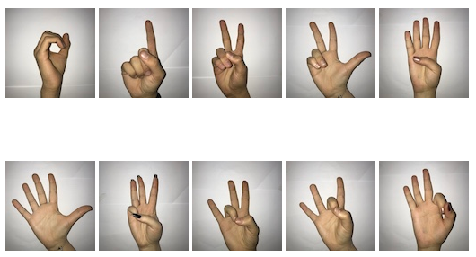
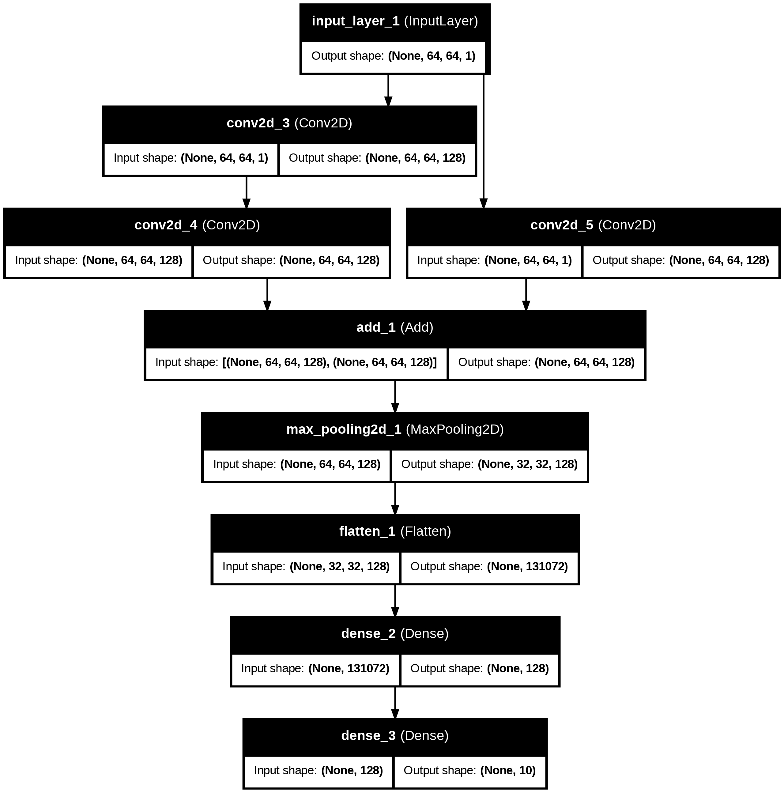

# Projet FDAA 2025 - Examen final

L'objectif de ce sujet est d'évaluer vos connaissances concernant la mise en place d'une architecture neuronale capable d'assurer une fonction de classification d'images.
Il s'agit d'images relatives au langage des signes. Chaque image contient un signe de la main qui représente un chiffre entre 0 et 9. Donc l'objectif est similaire à
ce que vous avez déjà réalisé sur la classification des images de la base MNIST.

L'ensemble des codes Keras que vous avez produit pendant les séances sont autorisés pendant l'examen. A la fin de l'épeuve vous m'enverrez ou vous me partagerez votre
"notebook examen" à l'adresse : sebastien.ambellouis@gmail.com. Cette évaluation est composée de plusieurs questions qui constituent les étapes à suivre pour atteindre
la production du modèle attendu. Vous devez donc me rendre un notebook clair et facilement exploitable. Attention : répartissez votre code dans plusieurs **cellules de code** successives. Je vous demande également de bien annoter et de commenter votre notebook à l'aide **des cellules de texte** afin de montrer votre
compréhension des opérations que vous effectuerez.

Ma correction est simple : j'exécute chaque cellule de votre notebook et je vérifie si aucune erreur n'apparaît et si le résultat attendu est obtenu.
Si je dois corriger des erreurs alors je poserai des pénalités. Répondez aux questions dans l'ordre afin d'atteindre l'objectif sereinement et d'accumuler les points.

## A vous de jouer ... bon courage ...

La base d'images et l'annotation de chacune d'entre elles sont contenues respectivement dans les deux fichiers numpy : **X.npy** et **Y.npy**.

Informations sur la base d'images (**X.npy**):
- Résolution des images : 64x64
- Espace colorimérique : Grayscale
- Nombre de classes: 10 (Chiffres de 0 à 9)

Information sur les annotations (**Y.npy**)
- Un label par ligne
- Chaque label est codé en utilisant la technique "one-hot" qui consiste comme vous le savez à encoder chacune des 10 classes sur 10 bits dont un seul prend la valeur 1 pour une classe donnée.

Les signes sont les suivants (0 à 4 sur la ligne 1 et 5 à 9 sur la ligne 2) :



Dans la suite vous devrez définir, entraîner, évaluer et inférer l'architecture neuronale suivante :

## Modèle fonctionnel


Comme vous pouvez le constater, cette architecture ne peut être définie de manière séquentielle car l'image constitue l'entrée de deux branches qui opèrent en parallèle. Par conséquent, il faudra utiliser une desccription fonctionnelle dans Keras.
(cf. [https://github.com/SebAmb/FDAA2025/blob/main/sequential%20vs%20functional.md]()

### **Question 1**

Charger les deux fichiers numpy dans deux variables. Afficher la "shape" de ces deux variables et afficher l'image 0 et l'image 2000 et l'annotation 0 et l'annotation 2000.

### **Question 2**

Afficher la valeur maximale et minimale des niveaux de gris sur toutes les images. Procéder à la normalisation de chaque image si nécessaires.

### **Question 3**

Produire un sous ensemble de test à partir de toutes les images que vous avez chargées et peut être normalisées précédemment. La base de test doit contenir 15% de toutes les images.


### **Question 4.1**

Dans cette question, je vous demande de définir uniquement la branche de gauche modèle neuronal présenté dans l'image précédente. Utiliser la description Keras dite fonctionnelle (cf. https://github.com/SebAmb/FDAA2025/blob/main/sequential%20vs%20functional.md).

Les filtres sont de taille 3x3 et la fonction d'activation de toutes les couches est une ReLU.

Attention à bien définir la shape de votre entrée conformément aux caractéristiques des images.

### **Question 4.2**

Pour obtenir le modèle définitf, ajouter la seconde branche dite résiduelle au modèlele modèle de la question 4.1.

### **Question 5**

Dans cette question vous allez lancer l'entraînement du modèle décrit à la **question 4.2**.

Pour cela vous allez suivre les étapes suivantes :
- compilation du modèle
- définition de la fonction de loss et la métrique d'accuracy
- fixer le nombre d'epoch (```epochs=20```)
- fixer la taille du batch

L'entrainement devra être mené sur une base d'entrainement et sur une base de validation à chaque epoch.

Ajouter la fonction callback afin de sauvegarder, au cours de l'entrainement, les poids du réseau  qui produisent un meilleur résultat que les poids précédemment enregistrés. Cela vous permettra de garder les "meilleurs" poids appris pour un usage ultérieur.

### **Question 6.1**

Une fois l'entraînement lancé et terminé (nombre d'épochs = 20) afficher les courbes d'apprentissage qui permettront de constater ou non un phénomène de sur-apprentissage.

### **Question 6.2**

Lancer l'évalution de votre meilleur modèle sur la base de test.
Quelle est la précision obtenue ?
Afficher la matrice de confusion de ce modèle.

### **Question 7**

Dans un nouvelle cellule de votre notebook créer un nouveau modèle en ajoutant une couche de __batchNormalization__ après chaque couche de convolution.
Relancer l'apprentissage et afficher les courbes d'apprentissage.
Comparer les performances obtenues avec celles de la **question 5**.

ATTENTION : ne pas modifier directement les cellules des questions **4.1**, **4.2**, **5**,**6.1** et **6.2**. Utiliser de nouvelles cellule de code.

### **Question 8**

Lancer l'évalution de votre meilleur modèle sur la base de test.
Quelle est la précision obtenue ?
Afficher la matrice de confusion de ce modèle.

### **Question 9**

Inférer le modèle sur les images placées dans le dossier evaluation du github : https://github.com/SebAmb/FDAA2025/tree/main/evaluation
L'objectif est de vérifier que le modèle est capable de reconnaître l'image de plusieurs signes de la main parmis ceux qu'il a appris.

---