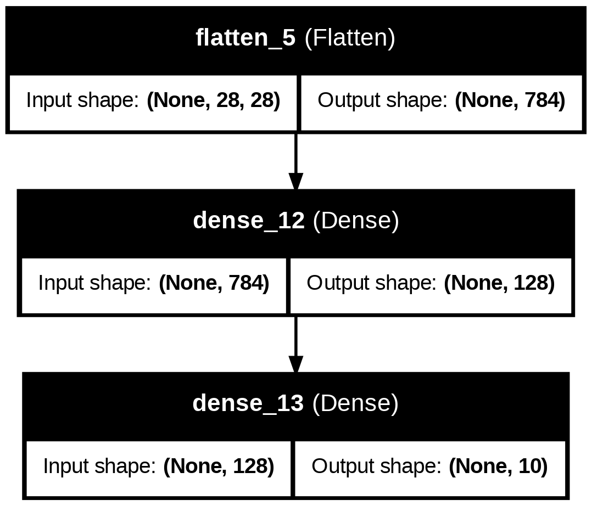
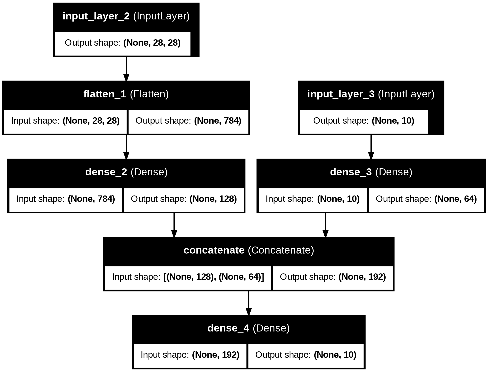

## **Définition d'un réseau avec Keras : Modèle Séquentiel vs Modèle Fonctionnel**

Keras propose deux manières principales de définir un réseau de neurones : **le modèle séquentiel** et **le modèle fonctionnel (non séquentiel)**.
Je vous propose une explication et une comparaison des deux.
Au cours des TD vous aurez à utiliser les deux descriptions.

---

### **1. Modèle Séquentiel**
Le modèle séquentiel est une méthode simple pour construire un réseau lorsque les couches s'empilent strictement les unes après les autres.

#### **Caractéristiques :**
- Les couches sont ajoutées dans un ordre **linéaire**.
- Chaque couche a une **entrée unique** et une **sortie unique**.
- Facile à comprendre et à utiliser pour des architectures simples.

#### **Exemple :**
```python
from tensorflow.keras.models import Sequential
from tensorflow.keras.layers import Dense, Flatten

# Définir un modèle séquentiel
model = Sequential([
    Flatten(input_shape=(28, 28)),  # Couche d'entrée
    Dense(128, activation='relu'),  # Couche cachée
    Dense(10, activation='softmax') # Couche de sortie
])
```

Dans cet exemple, chaque couche est ajoutée de manière séquentielle à la précédente. La première couche applatit les données d'entrée, la deuxième couche est composée de 128 neurones totalement connectés au 764 neurones de la couche applatie et la couche de sortie est composée de 10 neurones (un par classe) totalement connectés à aux 128 de la couche précédente.

---

### **2. Modèle Fonctionnel (Non Séquentiel)**
Le modèle fonctionnel permet de créer des architectures complexes, comme :
- Des réseaux avec **plusieurs entrées ou sorties**.
- Des réseaux avec des connexions résiduelles ou des bifurcations (comme dans **ResNet**).
- Des architectures **non linéaires**.

#### **Caractéristiques :**
- Les couches sont connectées explicitement via des objets `Tensor` i.e les sorties d'autres couches de l'architecture.
- Offre une grande flexibilité pour construire des réseaux avancés.
- Idéal pour des architectures complexes.

#### **Exemple :**
```python
from tensorflow.keras.models import Model
from tensorflow.keras.layers import Input, Dense, Flatten, concatenate

# Définir les entrées
input1 = Input(shape=(28, 28))  # Première entrée
input2 = Input(shape=(10,))    # Deuxième entrée 

# Appliquer des transformations aux entrées
x1 = Flatten()(input1)
x1 = Dense(128, activation='relu')(x1)

x2 = Dense(64, activation='relu')(input2)

# Fusionner les sorties des deux branches
merged = concatenate([x1, x2])

# Ajouter des couches finales
output = Dense(10, activation='softmax')(merged)

# Définir le modèle
model = Model(inputs=[input1, input2], outputs=output)
```

Dans cet exemple, on a deux entrées différentes, des branches parallèles et une concaténation pour fusionner les sorties.

## Modèle Séquentiel


## Modèle Fonctionnel



---

### **Comparaison**

| **Aspect**                | **Modèle Séquentiel**                                         | **Modèle Fonctionnel**                                      |
|---------------------------|-------------------------------------------------------------|------------------------------------------------------------|
| **Simplicité**            | Simple à utiliser, idéal pour les réseaux linéaires simples | Plus complexe à définir mais nécessaire pour des réseaux avancés |
| **Flexibilité**           | Limité aux architectures linéaires                          | Prend en charge les architectures complexes (branches, connexions résiduelles, etc.) |
| **Usage typique**         | Réseaux de type MLP, CNN de base                            | Architectures comme ResNet, Inception, réseaux multi-entrées/sorties |
| **Déclaration des couches** | Par une liste ou via `.add()`                              | Par des objets `Tensor` connectés explicitement             |

---

### **Quand utiliser quoi ?**
- **Modèle séquentiel :** Utilisez-le pour des architectures simples et linéaires, lorsque les données passent de manière unidirectionnelle d'une couche à l'autre.
- **Modèle fonctionnel :** Privilégiez-le pour des architectures complexes, lorsque vous avez besoin de plus de contrôle sur les connexions entre les couches.
